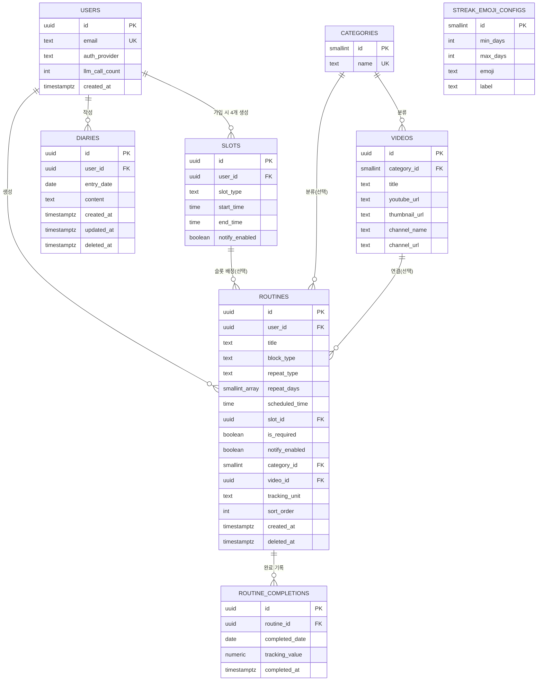

# Daily Loop — ERD

> `domain-model.md`를 실제 테이블로 옮긴 것. DB는 Supabase(PostgreSQL) 기준. 타입/제약은 초안이며 구현 단계에서 마이그레이션 파일로 확정.

---

## 1. ER 다이어그램



`streak_emoji_configs`는 다른 테이블과 FK 관계 없음 (전역 시드 데이터, 다이어그램엔 별도 표기만).

---

## 2. 테이블 정의

### users

| 컬럼 | 타입 | 제약 | 비고 |
|---|---|---|---|
| id | uuid | PK, default `gen_random_uuid()` | |
| email | text | UNIQUE, NOT NULL | |
| auth_provider | text | NOT NULL | `'google'` \| `'kakao'` |
| llm_call_count | integer | NOT NULL, default 0 | 무료 버전 상한 10 (앱 로직에서 체크) |
| created_at | timestamptz | NOT NULL, default `now()` | |

### slots

| 컬럼 | 타입 | 제약 | 비고 |
|---|---|---|---|
| id | uuid | PK | |
| user_id | uuid | FK → users.id, NOT NULL | |
| slot_type | text | NOT NULL | `'morning'`\|`'lunch'`\|`'evening'`\|`'before_sleep'` |
| start_time | time | NOT NULL | 기본값: 05:00/11:00/15:00/21:00 |
| end_time | time | NOT NULL | 기본값: 11:00/15:00/21:00/05:00(익일) |
| notify_enabled | boolean | NOT NULL, default true | 슬롯 단위 알림 토글 |

- `UNIQUE (user_id, slot_type)` — 유저당 슬롯 종류 중복 방지
- 회원가입 트리거(또는 앱 로직)에서 유저 생성 직후 4행 자동 insert

```sql
CREATE INDEX idx_slots_notify_time ON slots (start_time) WHERE notify_enabled = true;
-- 4-12 FCM 블록 알림 배치("현재 시각과 일치하는 슬롯을 가진 유저 조회")용.
-- 알림 꺼진 슬롯은 애초에 이 배치가 볼 필요가 없으므로 partial index로 범위를 좁힘
```

### categories

| 컬럼 | 타입 | 제약 | 비고 |
|---|---|---|---|
| id | smallint | PK | |
| name | text | UNIQUE, NOT NULL | 운동/뷰티/독서/모닝루틴/마인드풀니스/공부·자기계발 6행 시드 |

### videos

| 컬럼 | 타입 | 제약 | 비고 |
|---|---|---|---|
| id | uuid | PK | |
| category_id | smallint | FK → categories.id, NOT NULL | |
| title | text | NOT NULL | |
| youtube_url | text | NOT NULL | 임베드용 |
| thumbnail_url | text | NOT NULL | |
| channel_name | text | NOT NULL | 저작권 정책상 필수 표시 (6번) |
| channel_url | text | NOT NULL | |

```sql
CREATE INDEX idx_videos_category ON videos (category_id);
-- 4-10 카테고리 탭 그리드 조회(category_id로 필터)에 사용. PK/UNIQUE가 아닌 일반 FK 컬럼은
-- Postgres가 자동으로 인덱스를 만들어주지 않으므로 직접 추가해야 함
```

### routines

| 컬럼 | 타입 | 제약 | 비고 |
|---|---|---|---|
| id | uuid | PK | |
| user_id | uuid | FK → users.id, NOT NULL | |
| title | text | NOT NULL | |
| block_type | text | NOT NULL | `'check'` \| `'tracking'` |
| repeat_type | text | NOT NULL | `'daily'`\|`'weekday'`\|`'weekend'`\|`'custom'`\|`'once'` |
| repeat_days | smallint[] | NULL | `repeat_type='custom'`일 때만 사용, 0=일~6=토 |
| scheduled_time_start | time | NULL | 정확한 시각 지정 시 시작 시각 (0005 마이그레이션에서 `scheduled_time`을 이 이름으로 변경) |
| scheduled_time_end | time | NULL | 정확한 시각 지정 시 종료 시각 — `scheduled_time_start`와 항상 함께 채워짐 (0005 마이그레이션 신규). 오늘 탭에서 "지금 시각이 이 범위 안" 테두리 강조 판정에 사용 |
| scheduled_date | date | NULL | `repeat_type='once'`일 때만 사용 — 몇 번째 날짜에 할지 (신규, 0004 마이그레이션). 추가 화면(4-9) 기본값은 오늘 날짜 |
| slot_id | uuid | FK → slots.id, NULL | 시각 대신 슬롯 지정 시 |
| is_required | boolean | NOT NULL, default false | 캘린더 빨간 표시 판단 기준 (4-4) |
| notify_enabled | boolean | NOT NULL, default false | 루틴 단위 개별 알림 |
| category_id | smallint | FK → categories.id, NULL | |
| video_id | uuid | FK → videos.id, NULL | |
| tracking_unit | text | NULL | `block_type='tracking'`일 때만 (프리셋 또는 자유 텍스트) |
| sort_order | integer | NOT NULL, default 0 | 같은 시각/슬롯 내 사용자 지정 순서 |
| skip_holidays | boolean | NOT NULL, default false | true면 공휴일(`holidays` 테이블 기준)에는 반복 규칙과 무관하게 오늘 탭에서 제외 (0006 마이그레이션 신규) |
| created_at | timestamptz | NOT NULL, default `now()` | |
| deleted_at | timestamptz | NULL | 소프트 삭제 (3-2) |

**제약 조건**
```sql
CHECK ( (scheduled_time_start IS NOT NULL) <> (slot_id IS NOT NULL) )
-- 시각과 슬롯 중 정확히 하나만 채워져야 함 (user-flow 3번 확정)

CHECK ( scheduled_time_start IS NULL OR scheduled_time_end IS NOT NULL )
-- 정확한 시각 지정이면 시작~종료 범위가 항상 함께 있어야 함 (0005 마이그레이션, 오늘 탭 시간 강조용)

CHECK ( repeat_type <> 'custom' OR repeat_days IS NOT NULL )
-- custom 반복이면 요일 배열 필수

CHECK ( block_type <> 'tracking' OR tracking_unit IS NOT NULL )
-- 트래킹형이면 단위 필수

CHECK ( repeat_type <> 'once' OR scheduled_date IS NOT NULL )
-- 1회성이면 날짜 필수 (0004 마이그레이션에서 추가)
```

**인덱스**
```sql
CREATE INDEX idx_routines_user_active ON routines (user_id) WHERE deleted_at IS NULL;
CREATE INDEX idx_routines_required ON routines (user_id, is_required) WHERE deleted_at IS NULL;
-- 리마인더 알림(4-12) 판정: "오늘 필수 루틴 중 completion 없는 것" 조회에 사용
```

### routine_completions

| 컬럼 | 타입 | 제약 | 비고 |
|---|---|---|---|
| id | uuid | PK | |
| routine_id | uuid | FK → routines.id, NOT NULL | |
| completed_date | date | NOT NULL | |
| tracking_value | numeric | NULL | `block_type='tracking'`인 루틴만 값 존재 |
| completed_at | timestamptz | NOT NULL, default `now()` | |

- `UNIQUE (routine_id, completed_date)` — 하루 1건
- `CREATE INDEX idx_completions_date ON routine_completions (completed_date);` — 캘린더 월별 조회, 리마인더 판정용
- **무결성 주의**: `tracking_value`는 부모 `routines.block_type`이 `'tracking'`일 때만 값이 있어야 하는데, CHECK 제약은 다른 테이블을 참조할 수 없어서 DB 레벨로는 강제 불가. 앱 코드(저장 직전 검증) 또는 트리거로 보장해야 함

### diaries

| 컬럼 | 타입 | 제약 | 비고 |
|---|---|---|---|
| id | uuid | PK | |
| user_id | uuid | FK → users.id, NOT NULL | |
| entry_date | date | NOT NULL | |
| content | text | NOT NULL | |
| created_at | timestamptz | NOT NULL, default `now()` | |
| updated_at | timestamptz | NOT NULL, default `now()` | |
| deleted_at | timestamptz | NULL | 소프트 삭제 (3-2) |

```sql
CREATE UNIQUE INDEX idx_diaries_user_date_active
  ON diaries (user_id, entry_date) WHERE deleted_at IS NULL;
-- 소프트 삭제와 "날짜당 1개" 제약을 함께 만족시키기 위한 partial unique index
```

### routine_presets / preset_items (신규, 0007 마이그레이션)

루틴 모음집(프리셋) — "평일 일정", "주말", "학원"처럼 자주 쓰는 루틴 묶음을 미리 만들어두고 한 번에 적용하는 기능.

| 테이블 | 컬럼 | 비고 |
|---|---|---|
| routine_presets | id, user_id, name, repeat_type, repeat_days, skip_holidays, created_at | 반복 규칙·공휴일 제외는 모음집 전체에 하나로 적용 (개별 항목마다 다르게는 못 줌) |
| preset_items | id, preset_id, title, block_type, scheduled_time_start/end, slot_id, is_required, tracking_unit, sort_order | routines와 거의 동일한 필드 구조, 제약조건도 동일(시각/슬롯 XOR 등) |

- "적용"하면 preset_items를 그대로 복사해서 실제 routines 행을 생성 (routine_presets의 repeat_type/repeat_days/skip_holidays를 각 routine에 채워 넣음)
- 같은 루틴을 여러 모음집에 중복으로 넣어도 됨. 같은 날 여러 모음집을 적용해서 루틴이 중복 생성돼도 자동으로 걸러내지 않음 (사용자가 직접 지우면 됨)
- RLS: 본인 프리셋만 조회/수정 (본인 소유 여부는 preset_items도 상위 routine_presets.user_id를 참조해서 확인)

### routine_skip_dates (신규, 0009 마이그레이션)

루틴을 완전히 삭제하지 않고 "오늘 하루만" 목록에서 빼기 위한 예외 날짜 기록. 오늘 탭 스와이프 삭제가 이걸 씀.

| 컬럼 | 비고 |
|---|---|
| id, routine_id, skip_date | `UNIQUE (routine_id, skip_date)` |

- 오늘 탭 조회 시 `matchesToday` 판정과 별개로, 오늘 날짜가 이 테이블에 있는 루틴은 무조건 제외
- 반복 규칙 자체는 안 바뀌므로 다음 날부터는 다시 정상적으로 나타남
- 루틴 전체를 지우는 것(`routines.deleted_at` 소프트 삭제, 루틴 수정 화면의 "삭제" 버튼)과는 별개 기능
- RLS: 본인 루틴에 속한 것만 조회/수정 (routine_completions와 동일한 서브쿼리 패턴)

### routine_favorites (신규, 0008 마이그레이션)

루틴 즐겨찾기 — 자주 쓰는 개별 루틴을 "제목/타입/시간/필수여부" 템플릿으로 저장. 모음집(routine_presets)과 달리 반복 규칙이 없음(낱개 루틴 하나의 템플릿).

| 컬럼 | 비고 |
|---|---|
| id, user_id, title, block_type, scheduled_time_start/end, slot_id, is_required, tracking_unit, created_at | routines/preset_items와 거의 동일한 필드+제약(시각/슬롯 XOR 등) |

- 쓰이는 곳 2군데: (1) 루틴 추가 화면에서 "바로 추가"(반복=매일 기본값으로 즉시 생성) 또는 "수정해서 추가"(폼에 값 채워넣고 사용자가 반복 등 마저 입력), (2) 모음집 항목 추가 시 값 채워진 새 항목으로 바로 삽입
- RLS: 본인 것만 조회/수정

### holidays (신규, 0006 마이그레이션)

| 컬럼 | 타입 | 제약 | 비고 |
|---|---|---|---|
| date | date | PK | |
| name | text | NOT NULL | 예: "설날", "대체공휴일(광복절)" |

- 카테고리/영상처럼 전역 공용 데이터 (유저별 아님), 로그인 유저는 읽기만 가능
- 2026~2027년치를 웹 검색+언론 보도 교차 확인해서 미리 시드해둠. 노동절·제헌절은 2026년부터 새로 법정 공휴일로 지정된 것까지 반영함 (노동절은 대체공휴일 미적용, 제헌절은 적용). 매년 갱신 필요 (연말에 다음 해 날짜 추가)
- 루틴의 `skip_holidays=true`면, 이 테이블에 오늘 날짜가 있을 때 반복 규칙과 무관하게 오늘 탭에서 제외됨

### streak_emoji_configs

| 컬럼 | 타입 | 제약 | 비고 |
|---|---|---|---|
| id | smallint | PK | |
| min_days | integer | NOT NULL | |
| max_days | integer | NULL | 마지막 구간(365일+)은 NULL = 상한 없음 |
| emoji | text | NOT NULL | |
| label | text | NOT NULL | |

- 시드 데이터 8행 (자연 요소가 자라나는 컨셉, project-spec.md 4-11 참고): (7,13,💧,작은 물방울) / (14,20,🌱,여린 새싹) / (21,27,🔥,타오르는 불씨) / (28,55,☁️,떠오른 구름) / (56,90,🌳,무성한 나무) / (91,181,🌈,피어난 무지개) / (182,364,🏔️,우뚝 선 산) / (365,NULL,🌍,하나의 세계)
- 1~6일(1주 미만)은 표시 없음이므로 행 없음 (앱 로직에서 "구간 매칭 없으면 미표시" 처리)

---

## 3. 2차 버전 확장성 점검 (2026-07-19)

2차 로드맵(인앱결제/구독, 애드몹, 무료체험 자동전환, 무료·유료 기능 경계)을 기준으로 현재 스키마를 대조한 결과 — **기존 테이블을 변경해야 하는 항목은 없음.** 전부 새 테이블/새 컬럼 추가(additive)로 해결 가능:

| 2차에 필요한 것 | 대응 방식 |
|---|---|
| 인앱결제(구독) 연동 | `subscriptions` 테이블 신규 추가 (users FK) |
| 2개월 무료체험 → 자동전환 | `users.created_at` 기준 계산 가능, 정책 변경 대비 시 `trial_ends_at` 컬럼 추가 |
| 무료/유료 기능 경계 (루틴 개수 제한, 영상 일부 제한 등) | 기존 테이블에 `is_premium` 류 컬럼 추가 또는 앱 로직의 COUNT 처리 |
| 애드몹 광고 | DB 영향 없음 (클라이언트 SDK 영역) |

**watch-list (지금 당장 문제는 아니지만 2차 착수 시 재검토)**

- `users.llm_call_count`: 현재는 "평생 누적 10회 상한" 단순 카운터. 2차에서 "구독하면 매달 N회 리필" 같은 주기적 리셋 방식으로 바뀌면 이 컬럼만으론 부족 → 리셋 시점 컬럼(`llm_period_reset_at` 등) 추가 필요해질 수 있음
- 타임존 컬럼 없음: 1차는 국내(한국) 타겟이라 Asia/Seoul 고정으로 충분. 해외 확장 논의가 나오면 그때 `users.timezone` 추가

---

## 4. 테이블 최적화 재검증 (2026-07-19)

주요 조회 패턴(오늘 탭, 캘린더 월별 조회, FCM 배치, 영상 카테고리 탭) 기준으로 인덱스를 다시 점검함.

**보완해서 반영한 것**
- `videos.category_id`에 인덱스 추가 (위 표 참고) — 카테고리 탭 그리드 조회의 핵심 필터인데 누락돼 있었음. Postgres는 PK/UNIQUE와 달리 일반 FK 컬럼엔 인덱스를 자동으로 만들어주지 않음
- `slots (start_time) WHERE notify_enabled = true` partial index 추가 — FCM 블록 알림 배치가 매 주기마다 스캔하는 경로라 유저 수가 늘수록 효과가 커짐

**이미 적절했던 것 (그대로 유지)**
- `routine_completions`의 `UNIQUE (routine_id, completed_date)`는 "이 루틴의 완료 기록" 조회(오늘 탭, 캘린더)를 그대로 커버하고, `idx_completions_date`는 "이 날짜 전체" 조회(FCM 리마인더 배치)를 커버 — 역할이 겹치지 않아 중복 인덱스 아님
- `diaries`의 partial unique index가 `user_id`를 선행 컬럼으로 가지므로 "이 유저의 이번 달 일기" 조회에도 그대로 활용됨 — 별도 인덱스 불필요
- `routines`의 `deleted_at IS NULL` partial index 2개(활성 루틴 전체 / 필수 루틴)는 소프트 삭제된 행을 인덱스에서 아예 제외해서 크기와 스캔 비용을 줄여줌

**정규화 수준**: 과다 정규화(불필요하게 테이블 쪼갬)나 과소 정규화(중복 저장) 둘 다 없음 — 8개 테이블이 각자 독립적인 개념 하나씩만 담당하고 있어 1차 버전 규모에 적절

---

## 5. 아직 결정 안 된 부분 (구현 전 확정 필요)

- [x] ~~RLS 정책~~ → `supabase/migrations/0001_init.sql`에서 모든 사용자 데이터 테이블에 적용 완료 (6번 참고)
- `repeat_days`를 배열 대신 별도 조인 테이블로 정규화할지 — 1차 버전은 배열로 단순화, 요일별 통계 쿼리가 잦아지면 재검토

## 6. 실제 마이그레이션 (2026-07-19, `supabase/migrations/0001_init.sql`)

문서상 설계를 실제 SQL로 옮기면서 반영한 세부 사항:

- **`users.id`는 독립 PK가 아니라 `auth.users(id)`를 참조**하도록 수정 — Supabase Auth(구글/카카오 로그인)가 자동으로 만드는 `auth.users` 행과 우리 앱 프로필 테이블을 같은 id로 묶기 위함. 회원가입 로직을 따로 안 만들어도 됨
- **가입 트리거(`handle_new_user`)**: `auth.users`에 새 행이 생기면(로그인 최초 성공 시) `public.users` 프로필 + 기본 슬롯 4개를 자동 생성 — erd.md에 적어뒀던 "회원가입 시 4행 자동 insert"를 실제 트리거로 구현
- **카카오 provider 값**: 트리거에서 `raw_app_meta_data ->> 'provider'`로 읽는데, 이건 Supabase 기본 OAuth(구글)엔 정상 동작하지만 **카카오는 Custom Token 방식이라 이 필드가 안 채워질 수 있음** — 실제 카카오 로그인 구현할 때(3-1) 커스텀 토큰 발급 로직에서 이 값을 명시적으로 세팅해줘야 함, 지금은 기본값 `'google'`로 임시 처리해둠
- **enum 값 CHECK 제약 추가**: `auth_provider`, `slot_type`, `block_type`, `repeat_type` 각각에 허용값을 CHECK로 강제 (erd.md 원문엔 주석으로만 적혀있었음)
- `categories`, `videos`, `streak_emoji_configs`는 로그인 유저 전체가 읽기만 가능하도록 RLS 설정 (쓰기는 관리자만, 앱에서 직접 쓰기 없음)
