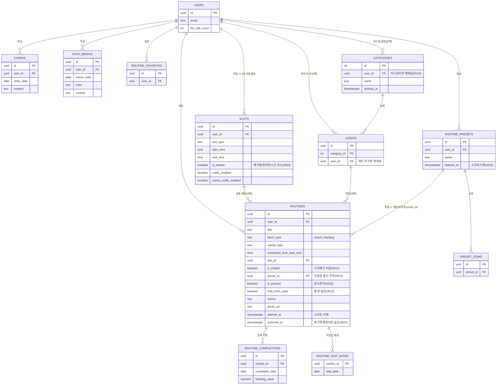

# Daily Loop — 기능 정의서 & 관계도

> **문서 목적**: 탭/화면/기능/데이터가 서로 어떻게 얽혀있는지 한눈에 보기 위한 문서. 기능이 많아지면서 "이거 고치면 저기 깨지는" 사고를 막는 게 목표.
> **역할 분담**: `project-spec.md`/`user-flow.md`/`domain-model.md`/`erd.md`는 "왜 이렇게 설계했나"(기획 의도), 이 문서는 "지금 실제로 뭐가 있고 서로 어떻게 연결돼있나"(현재 상태 스냅샷). 새 기능 추가/구조 변경할 때 이 문서를 먼저 훑고 시작할 것.
> **최신화 시점**: 2026-09-01, `supabase/migrations/0001~0024` + 코드 전체 기준.

---

## 1. 화면 트리 (Navigation Map)

```
app/_layout.tsx (루트 Stack, 로그인 여부로 분기)
├─ login.tsx                 — 구글 로그인
├─ auth/callback.tsx         — OAuth 콜백 처리
└─ (tabs)/_layout.tsx        — 로그인 후 진입, 우상단 ⚙️로 settings 진입 공통 제공
   ├─ (tabs)/index.tsx       [탭: 오늘]
   ├─ (tabs)/calendar.tsx    [탭: 캘린더]
   └─ (tabs)/stats.tsx       [탭: 통계]

   ↓ 탭 화면들에서 push되는 모달/스택 화면 (전역 Stack에 등록됨)
   ├─ routine-form.tsx        (modal) — 루틴 추가/수정
   ├─ preset-form.tsx         (modal) — 모음집 추가/수정
   ├─ presets.tsx                     — 모음집 목록
   ├─ favorite-form.tsx      (modal) — 즐겨찾기 추가/수정
   ├─ favorites.tsx                   — 즐겨찾기 목록
   ├─ diary-form.tsx         (modal) — 일기 작성/수정
   ├─ videos.tsx                      — 영상 목록(내 영상/추천 영상 탭)
   ├─ video-player.tsx                — 유튜브 재생
   ├─ my-routines.tsx                 — 전체 루틴 목록(필터/드래그정렬/삭제)
   ├─ routine-trash.tsx               — 삭제된 루틴/모음집 복구
   ├─ llm-input.tsx                   — 말로 루틴 추가(자연어 입력)
   └─ settings.tsx                    — 슬롯 알림, 로그아웃 등
```

**진입 경로 요약**
- `my-routines.tsx` / `favorites.tsx` / `presets.tsx` / `videos.tsx` / `routine-trash.tsx`: 오늘 탭 헤더 버튼 가로 스크롤에서 진입
- `routine-form.tsx`: 오늘 탭 "+ 루틴 추가", 즐겨찾기/모음집 항목에서 "추가", `llm-input.tsx` 미리보기, 루틴 목록 항목 수정 등 다경로 진입 (신규/수정/미리보기 3가지 모드)
- `diary-form.tsx`: 오늘 탭 "📔 일기"(오늘 날짜) 또는 캘린더 날짜 상세 "📔 일기 보기"(해당 날짜)
- `video-player.tsx`: 오늘 탭 리스트의 ▶ 아이콘, `videos.tsx` 그리드

---

## 2. 화면별 기능 정의 (기능 단위로 하나씩)

> 표 한 줄에 기능을 몰아넣지 않고, 화면마다 기능을 항목 하나씩 나열. 각 항목 옆 `함수명`은 그 기능이 부르는 lib 함수.

### `(tabs)/index.tsx` — 오늘 (탭)
관련 테이블: `routines`, `routine_completions`, `routine_skip_dates`, `slots`, `holidays`, `streak_emoji_configs`

- 오늘 할 루틴 리스트 뷰 — `fetchTodayRoutines`
- 타임라인 뷰(시간대별 블록 배치, 겹치면 "더보기") — `fetchTodayRoutines`
- 체크형 루틴 완료 처리 — `toggleCheckCompletion`
- 트래킹형 루틴 수치 입력/기록삭제 — `saveTrackingValue`
- 스와이프로 "오늘만 삭제" — `skipRoutineToday`
- 공휴일 배너 표시 — `fetchTodayHoliday`
- 루틴별 스트릭 이모지 뱃지 — `fetchStreaks`, `emojiForStreak`
- 필수 루틴 형광펜 강조 (`is_required`)
- "지금 시간" 강조 — 리스트 테두리 + 타임라인 강조선 (`isNowWithinRange`)
- 오늘 완료율 / 최고 기록 요약바

> 체크 시 `stats`/`calendar` 쿼리 캐시가 같이 갱신됨(4번 참고). 모음집·즐겨찾기로 만든 루틴도 결국 `routines` 행이라 여기서 같이 보임.

### `(tabs)/calendar.tsx` — 캘린더 (탭)
관련 테이블: `routines`(+삭제/보관 이력), `routine_completions`, `routine_skip_dates`, `holidays`, `date_memos`, `diaries`

- 월간뷰 날짜별 완료 상태 색칠(🟢다완료 / 🟠일부완료 / 🔴필수놓침) — `computeDayStatus`
- 주간뷰 전환 — `fetchWeekData`
- 날짜 클릭 → 바텀시트(체크리스트+메모+일기 진입) — `fetchMonthData` / `fetchWeekData`
- 오늘 날짜 탭-토글 체크(과거 날짜는 읽기 전용)
- 날짜별 짧은 메모 추가·수정·삭제(색상 5종) — `fetchMemosInRange`, `createMemo`, `updateMemo`, `deleteMemo`
- 일기 작성 여부 아이콘(📖) 표시 — `fetchDiaryDatesInRange`
- 역대 최고 스트릭 배지

> 삭제된 루틴도 삭제 전 날짜까진 표시(`matchesToday`의 생성일/삭제일 판정).

### `(tabs)/stats.tsx` — 통계 (탭)
관련 테이블: `routines`, `routine_completions`

- 최근 7일 전체 수행률 카드 — `fetchStats`
- 주간/월별 전환 뷰
- 루틴별 카드(현재 스트릭 / 역대 최고 스트릭 / 전체기간 수행률) — `fetchStats`
- 통계에서 숨기기 / 숨긴 항목 다시 보이기 — `setHideFromStats`

> "통계에서 숨김"은 `routines.hide_from_stats` — 오늘 탭/캘린더엔 영향 없음(통계 화면에서만 제외).

### `routine-form.tsx` (모달) — 루틴 추가/수정
관련 테이블: `routines`, `videos`, `routine-photos`(Storage)

- 루틴 신규 생성 — `createRoutine`
- 루틴 수정 — `updateRoutine`
- 시각 배치 3종 중 택1: 정확한 시각 / 슬롯 / 시각체크
- 반복 규칙 설정(매일 / 요일 조합 / 평일 / 주말 / 1회성)
- 필수 여부 토글
- 메모 + 사진 첨부 — `uploadRoutinePhoto`
- 영상 연결 — `VideoPicker` 컴포넌트
- 즐겨찾기에서 불러오기 / 즐겨찾기로 저장 — `FavoritePicker` 컴포넌트
- 공휴일 제외 토글
- 루틴 삭제(소프트) — `softDeleteRoutine`

> 시작/끝 시각 XOR 슬롯 제약 존재(DB CHECK). 완전삭제 기능은 없음(5번 정책 참고).

### `presets.tsx` / `preset-form.tsx` — 모음집
관련 테이블: `routine_presets`, `preset_items`, `routines`(`preset_id`로 연결 추적)

- 모음집 생성/수정(반복 규칙·공휴일 제외는 모음집 전체 공통) — `savePreset`
- "오늘 목록에 적용"(실제 루틴 대량 생성) — `applyPreset`
- 모음집 전체 활성화/비활성화 — `pauseRoutinesByPreset`
- 모음집 삭제(소프트) — `deletePreset`
- 모음집 목록 조회 — `fetchPresets`

> `applyPreset`은 살아있는(일시정지 포함) 연결 루틴이 있으면 재사용하고, 없을 때만 신규 생성(중복 생성 버그 수정판).

### `favorites.tsx` / `favorite-form.tsx` — 즐겨찾기
관련 테이블: `routine_favorites`

- 즐겨찾기 생성/수정 — `createFavorite`, `updateFavorite`
- 즐겨찾기 목록 조회 — `fetchFavorites`
- 즐겨찾기 삭제 — `deleteFavorite`
- 루틴 폼에서 "바로 추가" / "수정해서 추가"로 불러오기

> 모음집(preset)과 달리 반복 규칙이 없는 순수 값 템플릿.

### `my-routines.tsx` — 내 루틴
관련 테이블: `routines`, `routine_skip_dates`

- 전체 루틴 목록 조회 — `fetchAllRoutines`
- 반복주기 필터 / 모음집 필터
- 드래그로 순서 정렬 — `updateSortOrder`
- 다중 선택삭제 — `softDeleteRoutines`
- 루틴 일시정지/재개
- "오늘 제외됨" 표시 + "오늘 목록에 추가"로 되돌리기 — `fetchSkippedRoutineIds`, `unskipRoutine`
- 모음집이 0개가 되면 모음집도 같이 정리 — `cleanupEmptyPresets`

### `routine-trash.tsx` — 루틴 복구
관련 테이블: `routines`(`deleted_at`/`archived_at`), `routine_presets`(`deleted_at`)

- 삭제된 루틴 목록(2주 보관) 조회 — `fetchDeletedRoutines`
- 루틴 복구 — `restoreRoutine`
- 모음집째 복구 — `restoreRoutinesByPreset`
- 복구목록에서만 숨기기(보관 처리) — `archiveRoutines`
- 모음집 선택 즉시 완전삭제 — `hardDeletePreset`

> **루틴 자체는 완전삭제 기능 없음**(완료기록 보존을 위해 정책 폐지, 5번 참고). 즉시 완전삭제 가능한 건 모음집뿐.

### `diary-form.tsx` (모달) — 일기
관련 테이블: `diaries`

- 날짜별 일기 작성/수정 — `saveDiary`
- 그 날짜 일기 불러오기 — `fetchDiary`
- 일기 삭제 — `deleteDiary`

> 날짜 메모(`date_memos`)와는 별개 기능(하나뿐인 일기 vs 여러 개 가능한 짧은 메모).

### `videos.tsx` / `video-player.tsx` — 영상
관련 테이블: `videos`, `categories`, `hidden_default_categories`

- 카테고리별 "내 영상" 그리드 — `fetchVideosByCategory`, `CategoryVideoGrid` 컴포넌트
- "추천 영상" 탭 + 내 그리드에 추가 — `fetchRecommendedVideosByCategory`, `addRecommendedVideoToMyGrid`, `RecommendedVideoGrid` 컴포넌트
- 개인 유튜브 영상 추가(oEmbed로 제목/썸네일 자동완성) — `createUserVideo`
- 개인 영상 삭제 — `deleteUserVideo`
- 카테고리 생성 / 이름수정 — `createCategory`, `renameCategory`
- 카테고리 삭제(커스텀=소프트삭제 3일 / 기본=숨김) — `softDeleteCategory`, `hideDefaultCategory`
- 삭제된 카테고리 복구/완전삭제 — `restoreCategory`, `hardDeleteCategory`
- 숨긴 기본 카테고리 일괄 재생성 — `recreateDefaultCategories`
- 유튜브 영상 재생 + 채널 방문

> 기본 카테고리는 공용 행이라 진짜 삭제 불가라서 "숨김" 방식, 커스텀 카테고리만 진짜 소프트 삭제.

### `llm-input.tsx` — 말로 루틴 추가
관련 테이블: `routines`(최종 저장은 routine-form에서)

- 자연어 입력 → 정규식 우선 파싱 — `parseRoutineInput`
- 애매하면 AI 파싱으로 폴백 — `lib/llm.ts`
- "AI로 정확하게 분석" 강제 호출 버튼
- 파싱 결과를 `routine-form` 미리보기로 전달
- 무료 호출 한도 체크

> 뒤로가기는 `router.dismissTo`로 처리(새 인스턴스 안 쌓게) — 초안 텍스트는 화면이 스택에서 완전히 제거될 때만 초기화.

### `settings.tsx` — 설정
관련 테이블: `slots`

- 슬롯 4개(아침/점심/저녁/자기전) 시간 조정 — `updateSlot`
- 슬롯 체크형 ↔ 정확한 시간 모드 전환 — `updateSlot`
- 슬롯별 알림 on/off — `syncSlotAlarms`
- 메모 알림 on/off — `syncSlotAlarms`
- 로그아웃

> 슬롯 시간/모드가 바뀌면 앱을 다시 열어야 알림이 재동기화됨(5번 정책 참고).

---

## 2-B. 공용 컴포넌트 (`components/`)

여러 화면에서 재사용되는 컴포넌트. 여기 하나를 고치면 "쓰이는 곳" 전부에 영향이 감.

| 컴포넌트 | 역할 | 쓰이는 곳 |
|---|---|---|
| `CategoryVideoGrid.tsx` | 카테고리 가로탭 + 2열 영상 그리드, 카테고리 CRUD 모달까지 포함 | `videos.tsx`(내 영상 탭), `VideoPicker`가 내부적으로 재사용 |
| `RecommendedVideoGrid.tsx` | 관리자 큐레이션 추천 영상 그리드(기본 카테고리 전용), "내 그리드에 추가" 제공 | `videos.tsx`(추천 영상 탭) |
| `VideoPicker.tsx` | 루틴 폼에서 영상 연결용 바텀시트 모달 | `routine-form.tsx` |
| `FavoritePicker.tsx` | 즐겨찾기 선택 바텀시트 모달 | `routine-form.tsx`, `preset-form.tsx` |
| `Chip.tsx` | 선택형 칩 UI(단일 선택 표시) | `favorite-form.tsx`, `preset-form.tsx`, `routine-form.tsx` |
| `Toast.tsx`(`useToast`) | 확인 버튼 없는 반투명 자동소멸 알림 | `presets.tsx` |
| `Themed.tsx` | 라이트/다크 테마 대응 `Text`/`View` 래퍼 | 전체 화면 공통 |

---

## 3. 데이터 모델 관계도 (최신, 2026-09-01)



> `holidays`, `streak_emoji_configs`, `hidden_default_categories`는 사용자별이 아닌 참조/보조 테이블이라 위 다이어그램에선 생략. 상세 컬럼은 `docs/erd.md` 참고(단, `erd.md`는 0012까지만 반영된 구버전 — 실제 컬럼 진위는 `supabase/migrations/*.sql`이 최종 소스).

---

## 4. 화면 간 공유 상태 — 실제로는 3가지 메커니즘이 따로 동작함

"같은 쿼리 키를 쓰면 자동 갱신된다"는 한 문장으로는 설명이 안 됨(2026-09-01 코드 대조로 확인). 실제로 동작하는 3가지를 구분해서 볼 것.

### ① 동일 키 공유 — 정말로 같은 캐시를 그대로 재사용
| 쿼리 키 | 쓰는 화면 |
|---|---|
| `['slots', userId]` | settings, favorites, routine-form, preset-form, favorite-form |
| `['favorites', userId]` | favorites, routine-form, preset-form |
| `['presets', userId]` | presets, my-routines |
| `['stats', userId]` | calendar, stats(오늘 탭은 prefetch만 함, 실제로 쓰진 않음) |
| `['streak-configs']` | 오늘, stats |

### ② 수동 invalidate — 명시적으로 "이 키도 갱신해라"라고 호출해줘야만 반영됨 (까먹기 쉬운 지점)
| 이 화면에서 이 동작을 하면 | 수동으로 invalidate하는 키 | 근거 |
|---|---|---|
| 모음집 적용/삭제/일시정지 (`presets.tsx`) | `today-routines`, `all-routines` | presets.tsx:43,47,61,62,76,77 |
| 내 루틴에서 "오늘 목록에 추가"(unskip) | `today-routines` | my-routines.tsx:204 |
| 오늘 탭 체크/트래킹 완료·취소 | `streaks`만 — **stats·calendar는 대상이 아님** | index.tsx:839,902 |

> **비대칭 주의**: 오늘 탭에서 스와이프로 "오늘만 삭제"해도 `today-skips`(내 루틴 화면의 "오늘 제외됨" 표시용)는 갱신 안 됨 — "내 루틴→오늘" 방향 invalidate만 있고 "오늘→내 루틴" 방향은 없음. 지금은 두 화면을 동시에 띄우는 UI가 없어서 문제 없지만, 앞으로 "오늘 제외됨" 뱃지를 다른 곳에도 노출한다면 이 비대칭을 기억할 것.

### ③ 포커스 재요청(`useRefetchOnFocus`) — 화면에 돌아올 때마다 통째로 다시 불러옴
`staleTime: 0` + 최초 마운트 이후 포커스마다 자동 refetch(`lib/use-refetch-on-focus.ts`). **stats/calendar가 오늘 탭 체크 결과를 반영하는 진짜 이유는 캐시 공유가 아니라 이 메커니즘** — 탭을 오갈 때마다 매번 새로 불러오는 것뿐임.
- 적용됨: 오늘, my-routines, presets, favorites, calendar, stats, routine-trash, `CategoryVideoGrid`
- 적용 안 됨(모달이라 닫으면 언마운트 → 다시 열 때 자연스럽게 새로 불러와서 필요 없음): routine-form, preset-form, favorite-form, diary-form, video-player, settings, llm-input

### ④ 영상 캐시는 그리드와 단건 조회가 서로 다른 키 — 연동 안 됨
- `videos.tsx`의 그리드(`CategoryVideoGrid`): `['video-categories', userId]` / `['videos-by-category', selectedId, userId]`
- `routine-form.tsx`/`video-player.tsx`의 영상 1개 미리보기: `['video', id]`

서로 무관한 캐시라서 영상을 지워도 이미 열려있던 미리보기엔 반영이 안 될 수 있음. 다만 영상 "수정"(제목 변경 등) 기능 자체가 없어서(`lib/videos.ts`엔 `createUserVideo`/`deleteUserVideo`만 있고 `updateVideo`는 없음) 실사용 영향은 "보고 있던 영상이 방금 다른 화면에서 삭제됨" 정도의 낮은 빈도 엣지케이스.

**주의**: `Set`/`Map` 타입을 담는 쿼리(`today-skips`, `month-data`, `week-data`)는 AsyncStorage 오프라인 캐시에 저장됐다 복원되면서 JSON 직렬화로 깨지는 사고가 있었음 — `lib/query-client.ts`의 `NO_PERSIST_QUERY_ROOTS`에 이미 세 개 다 등록돼 있음. 새로 Map/Set을 담는 쿼리를 추가하면 반드시 여기에도 추가할 것.

---

## 5. 크로스커팅 정책 (버그가 실제로 났던 지점들)

**① 삭제 계층 — 4단계가 서로 다름, 헷갈리기 쉬움**

| 대상 | 삭제 방식 | 복구 가능? | 완료기록에 영향 |
|---|---|---|---|
| 오늘 탭 스와이프 (`routine_skip_dates`) | 그날 하루만 목록 제외 | "내 루틴"에서 "오늘 목록에 추가"로 즉시 복구 | 없음 |
| 루틴 "삭제" 버튼 (`routines.deleted_at`) | 소프트 삭제, **기한 없이** "루틴 복구" 목록에 남음 | "루틴 복구"에서 무기한 복구 가능(완전삭제 기능 자체가 없음) | **보존**(캘린더/통계는 삭제 전 날짜까지 계속 반영) |
| "루틴 복구"에서 루틴 "선택 정리" (`routines.archived_at`) | 삭제된 루틴을 "루틴 복구" **목록에서만** 뺌(`archiveRoutines`) | **복구 UI 없음 — 영구히 목록에서 사라짐(의도된 동작, 확정)**: 확인창을 한 번 더 거쳐 사용자가 명시적으로 고른 삭제라서, 되돌리기를 지원 안 하는 게 맞다는 결론(2026-09-01) | 영향 없음, 완료기록은 계속 안전 |
| 모음집 삭제 (`routine_presets.deleted_at`) | 소프트 삭제, **2주** 지나면 자동 완전삭제(`purgeOldDeletedPresets`) | "루틴 복구"에서 2주 내 복구 또는 "선택 정리"로 즉시 완전삭제 선택 가능 | 모음집 자체엔 완료기록 없음(템플릿이라) — 연결됐던 루틴은 별개로 안 지워짐 |

> `routine-trash.tsx`의 "선택 정리" 버튼은 모음집을 고르면 `hardDeletePreset`(진짜 완전삭제), 루틴을 고르면 `archiveRoutines`(목록에서만 제거)로 서로 다르게 동작하지만, 실행 전 확인창(`routine-trash.tsx:195-199`)이 "모음집 N개는 완전히 삭제돼요 / 루틴 N개는 이 목록에서만 정리돼요"라고 이미 구분해서 안내하고 있어 헷갈릴 소지는 낮음 — **2026-09-01 확인 후 현재 방식 유지하기로 확정.**

**② 시각 배치 방식 — 루틴 하나는 반드시 아래 중 하나**
- **정확한 시각** (`scheduled_time_start/end`): 타임라인에 실제 길이로 표시
- **슬롯** (`slot_id`, 아침/점심/저녁/자기전): 슬롯 자체가 체크형(점만 표시)인지 정확한 시간형인지에 따라 타임라인 표현이 갈림(`slots.is_instant`)
- **시각 체크** (`routines.is_instant`): "8시 기상"처럼 순간만 체크, 시간대를 차지 안 함
→ 세 방식은 DB 제약(XOR)으로 강제되고, `routine-form.tsx`/`preset-form.tsx`/`favorite-form.tsx` 셋 다 동일한 선택 UI를 씀 — 한 곳만 고치면 나머지 두 곳도 같이 봐야 함.

**③ 알림 재계산 방식**
슬롯 알림/메모 알림/자기전 리마인더 전부 "매일 반복 예약"이 아니라 **"다음 발송 시점을 다시 계산해서 1회성으로 재예약"**하는 방식(`syncSlotAlarms`/`syncReminderAlarm`). "앱을 열 때"라고 뭉뚱그리기보다, 실제로는 아래 4개 이벤트마다 각각 호출됨(2026-09-01 코드 확인):
- 오늘 탭 데이터 로드 성공할 때마다 — `syncSlotAlarms` + `syncReminderAlarm` (index.tsx:741-744)
- 오늘 탭 체크/트래킹 완료·취소할 때마다 — `syncReminderAlarm`만(필수 미완료 상태가 매번 바뀌므로) (index.tsx:840,860,903)
- 캘린더에서 그날 메모 추가/삭제할 때 — `syncSlotAlarms`만(메모 알림 내용이 바뀌므로) (calendar.tsx:334,349)
- 설정에서 슬롯 시간/모드/알림 토글 저장할 때 — `syncSlotAlarms` + `syncReminderAlarm` (settings.tsx:109-110)

앱을 며칠 안 열면(=위 이벤트가 하나도 안 일어나면) 그 사이엔 알림이 갱신되지 않는 게 알려진 한계.

**④ 날짜 판정 기준**
- "그날"의 기준은 항상 자정(00:00) — 슬롯이 새벽까지 이어져도 스트릭/통계/캘린더는 자정 기준으로 끊음
- `created_at`/`deleted_at`은 UTC 저장이라 그대로 앞 10글자만 자르면 한국 새벽 시간대에 하루 어긋남 — 반드시 `localDateOf` 류 헬퍼로 로컬 날짜 환산 후 비교

**⑤ 트래킹형 루틴**
목표치 달성/미달성 판정 없음 — 값이 하나라도 입력되면 그날은 무조건 "완료".

---

## 6. lib 파일 책임 맵

| 파일 | 책임 범위 |
|---|---|
| `lib/routines.ts` | 루틴 CRUD, 오늘/월/주 조회, 체크·트래킹 완료 처리, 스트릭 계산, 슬롯 CRUD, 통계 |
| `lib/presets.ts` | 모음집 CRUD, 적용(대량 루틴 생성/재사용), 삭제 시 연결 루틴 정리 |
| `lib/favorites.ts` | 즐겨찾기 CRUD |
| `lib/videos.ts` | 영상 CRUD(개인/추천), 카테고리 CRUD(커스텀/기본 숨김·복원) |
| `lib/diary.ts` | 일기 CRUD, 일기 있는 날짜 조회 |
| `lib/date-memos.ts` | 캘린더 짧은 메모 CRUD |
| `lib/notifications.ts` | 알림 채널 설정, 슬롯/리마인더 알림 재동기화 |
| `lib/parse-routine-input.ts` | 자연어 → 루틴 필드 정규식 파싱(순수 함수) |
| `lib/llm.ts` | AI 파싱 폴백 호출(Supabase Edge Function) |
| `lib/query-client.ts` | react-query 설정 + AsyncStorage 오프라인 캐시(직렬화 제외 목록 관리) |
| `lib/use-refetch-on-focus.ts` | 화면 포커스 시 재조회 훅 |
| `lib/google-signin.ts` / `lib/auth-context.tsx` | 구글 로그인, 세션 컨텍스트 |
| `lib/supabase.ts` | Supabase 클라이언트 초기화 |

---

## 7. 다음에 채워야 할 것 (사용자 리뷰 후 추가)

- [ ] 각 화면 스크린샷 또는 와이어프레임 링크
- [ ] "왜 이 정책을 택했는지" 이유는 이미 `CLAUDE.md`/`docs/study.md`에 있음 — 필요하면 이 문서에 링크만 추가
- [ ] 2차 로드맵(구독/광고) 붙을 때 이 문서에 영향받는 섹션 표시
